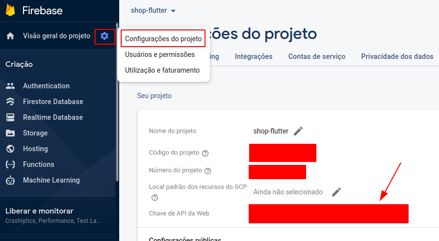
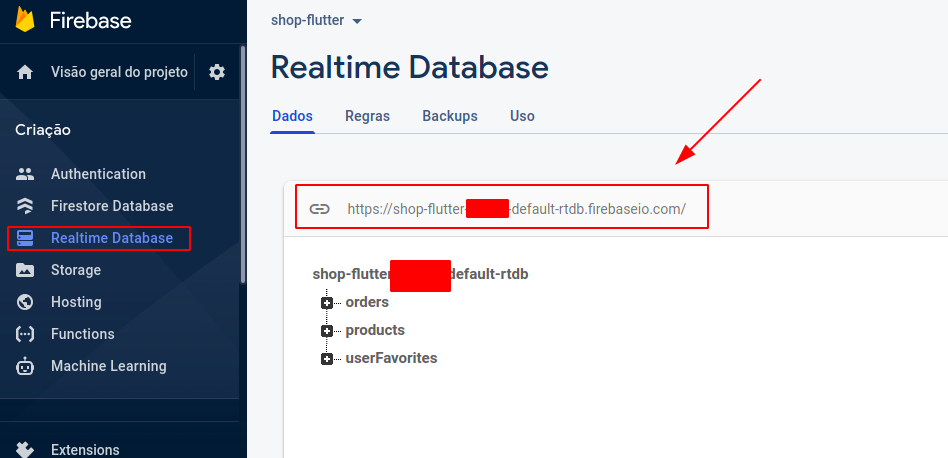

[](https://www.linkedin.com/in/felipeolliveira/)

.

> Este aplicativo está em português do Brasil, você pode experimentá-lo sem problemas 😆

> This app is in Brazilian Portuguese, you can try it without any problems 😆

- [English Readme](./README.md)

.

# Flutter Shop

Este é um projeto desenvolvido totalmente em Flutter 2.0 com a finalidade de estudo apenas.

Nessa aplicação você pode criar uma conta, autenticar seu usuário, gerenciar os produtos, favoritar, adicionar no carrinho e fazer pedidos.

Por enquanto, eu criei apenas para o Android.


# Ferramentas, Pacotes e Tecnologias


- **Provider**: gerenciamento de estados.
- **Intl**: internacionalizações e localizações de data, mensagens, moedas, entre outros.
- **Http**: requisições HTTP
- **Fluttertoast**: mensagens toast sem utilização do Scaffold.
- **Shared_preferences**: persistência dos dados da aplicação (local storage). 
- **Flutter_dotenv**: resolver variáveis de ambiente.

# Rodar localmente

Você precisa basicamente do Flutter, Dart e o Firebase, sendo esse ultimo, especificamente de dois serviços:

- Serviço de Autenticação - [Firebase Authentication](https://firebase.google.com/docs/auth)
- Serviço de Banco de Dados em Tempo Real - [Firebase Realtime Database](https://firebase.google.com/docs/database?hl=pt_br)

Ambos os serviços são gratuitos e tem um limite de uso, porém, para aplicativos de estudo como esse é improvavél que chegue nesse limite.

Após isso, basta copiar a url do Firebase Realtime Database e a sua chave de Api do Firebase Authentication que são encontrados dentro dos respectivos serviços:

- Chave de Api Web


- Url do Realtime Database


E depois inserir em um arquivo `.env` na raíz do projeto. Para facilitar, duplique o arquivo `.env.sample` e renomeie removendo o `.sample`:

```
# Firebase credentials
FIREBASE_AUTH_URL='sua chave vai entre as aspas'
FIREBASE_REALTIME_URL='a url do RealtimeDB vai aqui, entre as aspas'
```

# Minha experiência


# Mais sobre Flutter e Dart

- [Lab: Write your first Flutter app](https://flutter.dev/docs/get-started/codelab)
- [Cookbook: Useful Flutter samples](https://flutter.dev/docs/cookbook)

[](https://flutter.dev/)

[](https://dart.dev/)
